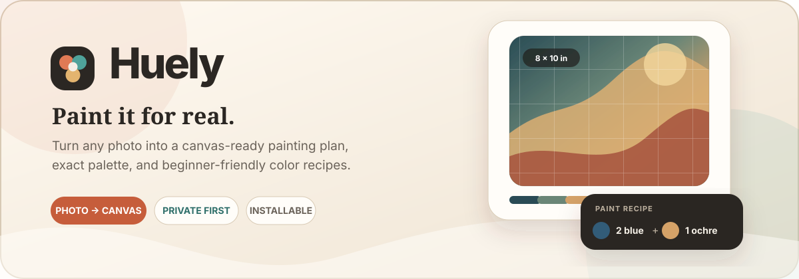

<p align="center">
  
</p>

<p align="center">
  <a href="https://huely.vercel.app"><strong>Open Huely</strong></a>
  &nbsp;·&nbsp;
  <a href="#painting-flow">See how it works</a>
  &nbsp;·&nbsp;
  <a href="#run-locally">Run locally</a>
</p>

<p align="center">
  
  
  
  
  
</p>

## Paint from a photo, with a plan

**Huely is a mobile-first painting companion for real canvases.** It turns a photo into a canvas-sized reference, extracts a practical palette, explains how to mix each color, and guides a beginner through the painting order.

It is not another drawing app. Huely helps you put the phone down and put paint on a physical canvas.

> [!TIP]
> Try the live app at **[huely.vercel.app](https://huely.vercel.app)**. It works in guest mode and can be installed on your phone like an app.

## Painting flow

| Step | What Huely helps you do |
| --- | --- |
| **01 · Choose** | Take a photo with the camera or pick one from your library. |
| **02 · Fit** | Enter the real canvas size, choose portrait or landscape, then crop or fit the reference to that exact ratio. |
| **03 · Study** | Switch between Original, Oil, Numbers, and Value views; zoom, pan, add a grid, or sample any color. |
| **04 · Paint** | Follow the suggested order, drag tube colors onto the wooden palette, size the batch in mL, and mark finished areas as you go. |
| **05 · Compare** | Photograph the physical canvas and inspect it beside, over, or split against the reference. |

## Built for the painting table

| Canvas workspace | Paint Lab |
| --- | --- |
| Exact canvas dimensions and orientation | Dominant palette with HEX and RGB values |
| Fill-frame or show-whole-photo fitting | Interactive wooden palette with draggable paint |
| Touch zoom, pan, grid, guides, and flip | RYB recipes with exact parts and mL batch guides |
| Oil, numbered, value, and original views | Save custom mixtures in **My Paints** |
| Eyedropper and isolated-color inspection | Step-by-step depth, shadow, and highlight guidance |

| Projects | Progress |
| --- | --- |
| Artwork-first project shelves grouped by day | Mark palette colors as painted |
| Local guest history or account sync | Restore each project's workspace state |
| Full-resolution source cache on the device | Camera check-ins for the real canvas |
| Installable mobile PWA | Split, overlay, and side-by-side comparison |

## Privacy first

Huely performs the heavy image analysis in your browser through a Web Worker.

- The full-resolution reference and photos of your physical canvas remain in device-local IndexedDB.
- Guest projects stay entirely on that device.
- When signed in, Huely syncs project metadata, a reduced thumbnail, palettes, recipes, and progress to Supabase.
- Supabase row-level security keeps each account's projects separate.

## Tech stack

- **Framework:** Next.js 16 App Router and React 19
- **Language and UI:** TypeScript and Tailwind CSS 4
- **Image pipeline:** Canvas APIs and a dedicated Web Worker
- **Device storage:** IndexedDB through `idb`
- **Accounts and cloud history:** Supabase Auth and Postgres
- **Hosting:** Vercel with an installable PWA shell

## Run locally

### Requirements

- Node.js **20.9 or newer**
- npm

### Start the app

```bash
git clone https://github.com/Cocokylez/huely.git
cd huely
npm install
npm run dev
```

Open [http://localhost:3000](http://localhost:3000). Supabase is optional—without it, Huely starts in guest mode with local project history.

## Optional accounts and cloud history

1. Create a [Supabase](https://supabase.com) project.
2. Copy `.env.example` to `.env.local` and add your project values:

   ```env
   NEXT_PUBLIC_SUPABASE_URL=https://your-project.supabase.co
   NEXT_PUBLIC_SUPABASE_PUBLISHABLE_KEY=sb_publishable_your-key
   NEXT_PUBLIC_SITE_URL=http://localhost:3000
   ```

3. Run [`supabase/schema.sql`](./supabase/schema.sql) in the Supabase SQL editor.
4. Add `http://localhost:3000/auth/callback` to the allowed redirect URLs in Supabase Authentication.
5. Restart the development server.

For production, add the same environment variables in Vercel, set `NEXT_PUBLIC_SITE_URL` to the deployed origin, and allow `https://your-domain/auth/callback` in Supabase.

> [!NOTE]
> Huely also accepts `NEXT_PUBLIC_SUPABASE_ANON_KEY` for older Supabase projects, but the publishable key is preferred.

## Project map

```text
app/                  Routes, authentication, manifest, and app shell
components/create/    New-project flow and canvas framing
components/history/   Project gallery and device storage controls
components/studio/    Painting workspace, palette, guides, and comparison
components/mixer/     Paint Lab, recipes, and saved mixtures
components/ui/        Shared icons and feedback components
lib/canvas/           Canvas dimensions and aspect-ratio helpers
lib/image/            Oil render, quantization, color names, and recipes
lib/history/          Local storage, cloud sync, and workspace restoration
lib/worker/           Off-main-thread image-processing pipeline
lib/supabase/         Browser and server Supabase clients
supabase/schema.sql   Database schema and row-level security policies
```

## Status

Huely is in active development. The current focus is visual refinement, smoother workspace ergonomics, a cleaner Paint Lab, and a guided first-project tutorial.

Ideas and bug reports are welcome in [GitHub Issues](https://github.com/Cocokylez/huely/issues).

<p align="center">
  Made for painters learning one color at a time.<br />
  Designed and built by <a href="https://github.com/Cocokylez"><strong>Adrian Kyle Condeza</strong></a>.
</p>
